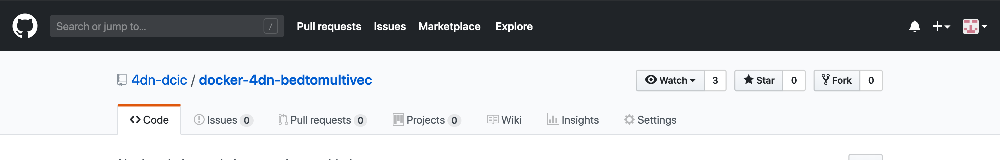
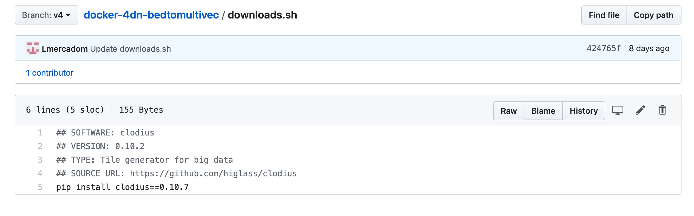
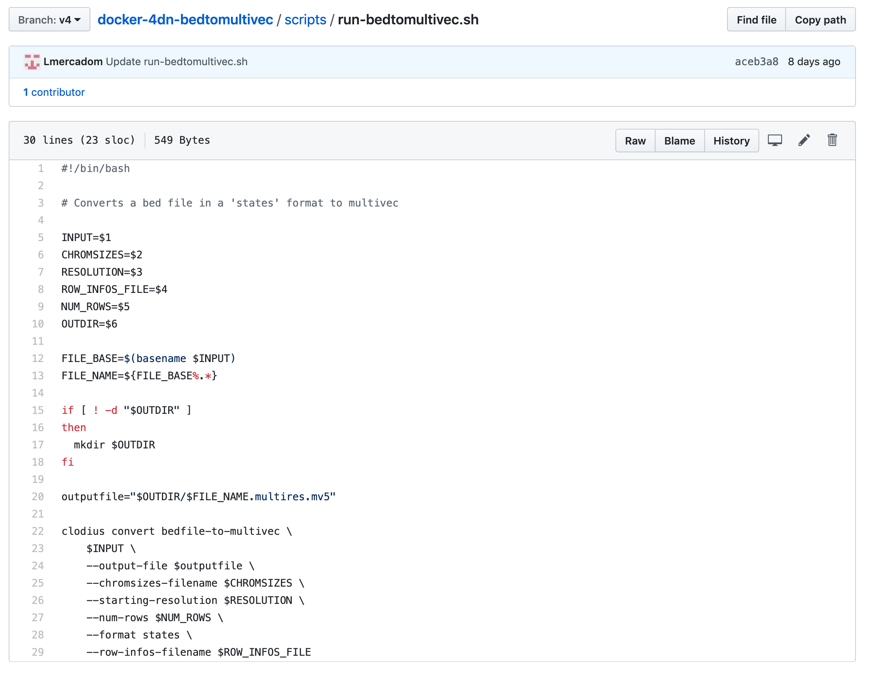

Docker Image Repo
=================

Getting Started
----------------

The first thing to do is to create a Github repository for the pipeline. This
repository should follow the 4DN-DCIC general conventions.

4DN-DCIC General conventions
-----------------------------

**Naming:**

The name of the repo should start by the prefix **docker-4dn-** followed by the name of the repo.
The name should be informative about what the pipeline does.

Example: This pipeline converts a file from bed format to multivec format.

**The Dockerfile:**

This file contains the instructions to assemble the docker image.

Example:

.. image:: images/dockerfile_image.png

You can find a template of the Dockerfile `here <https://github.com/4dn-dcic/documentation_management/blob/master/docs/source/files/Dockerfile>`_

**The downloads.sh file:**

This file contains the software that needs to be used to run the pipeline.

Example:

**The requirements.txt/environment.yml file:**

This file contains the packages and the versions used to run the software

**The scripts folder**

This folder contains the scripts that are going to be run.
The ``run-<repo-name>.sh`` is the master file. It contains the command-line
instructions to run the scripts and tools inside the docker from input to output.

Example:

.. note:: Create a new branch from master and label it with a version such as v1, v2...

Testing the docker image locally
---------------------------------

In order to test the docker image locally, you need to download and install docker.

Once docker is installed in your computer, clone the repo and go to the local folder.
Run the following command to build the local image:
::

    $ docker build -t <name-of-the-local-image>:version .

The name of the local image is the same and the name of the repo.
Make sure to include the version that corresponds to the branch label.

Example:

::

    $ docker build -t 4dn-bedtomultivec:v4 .

Once the docker image is build, you can test it by running the command:
::

    $ docker run -v <path-to-test-files>:/d1/:rw <the-docker-image> run-<repo-name>.sh [parameters]

Example:

::

    $ docker run -v /users/luisa/test_files/:/d1:rw 4dn-bedtomultivec:v4 run-bedtomultivec.sh /d1/test_file.bed /d1/test.chrom.sizes 200 /d1/infos.txt 15 /d1/

Once your local image works properly and gives the correct output, you can push the docker image to DockerHub.
Ask Soo to add your github username to the dcic DockerHub repo.

First tag the image using the following command:
::

    $ docker tag <your_image_name>:<version> 4dndcic/<your_image_name>:<version>

Example:
::

    $ docker tag 4dn-bedtomultivec:v4 4dndcic/4dn-bedtomultivec:v4

Now you can push the image to the dockerhub repo:
::

    $ docker push 4dndcic/4dn-bedtomultivec:v4

.. note:: You may need to login first to the DockerHub account using the command ``docker login`` and entering your username and password. You can now check the docker image in the DockerHub repo.
