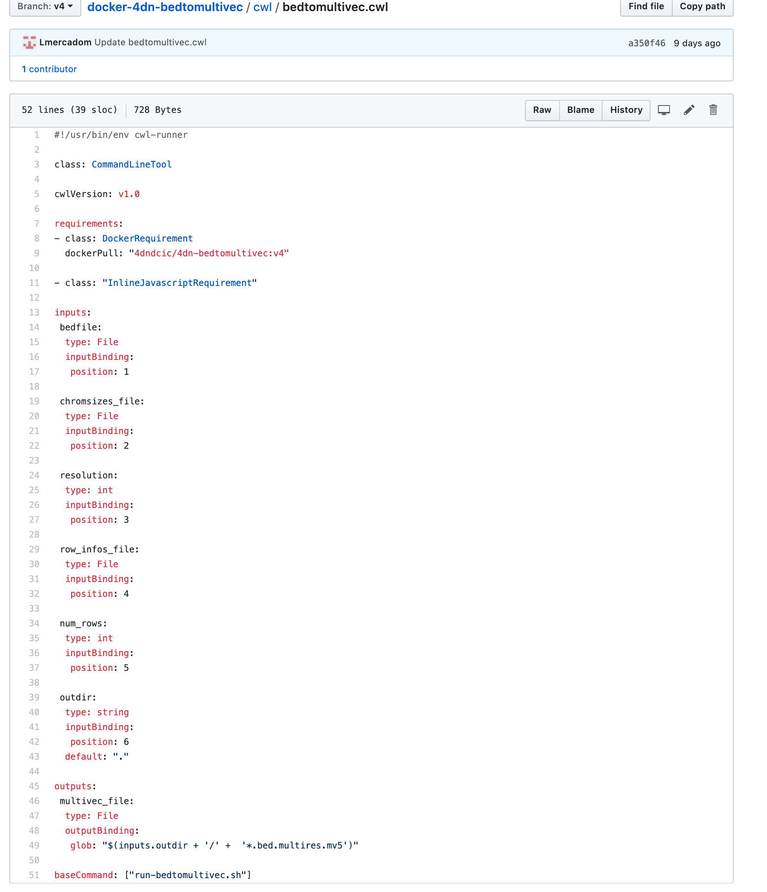

CWL workflow
============

Once the docker image is setup, it is time to create a workflow to run the
pipeline inside the docker.

First create a folder in the repo called ``cwl``. Inside the folder create a cwl file
called ``<repo-name>.cwl``. The cwl file should describe all the inputs
(including files and parameters), the outputs and the order in which they occur.

Example:

.. note::

          Except for the inputs and outputs, the cwl file follows the same
          convensions as the example above.

          The ``cwlVersion`` is v1.0

          The ``dockerPull`` should make reference to the image in DockerHub

          The ``baseCommand`` should make reference to the run.sh file

          Here is a cwl file template [LINK TO TEMPLATE]
